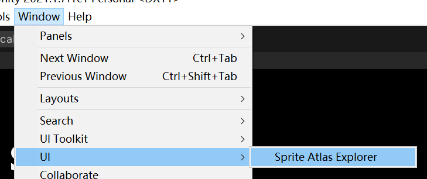
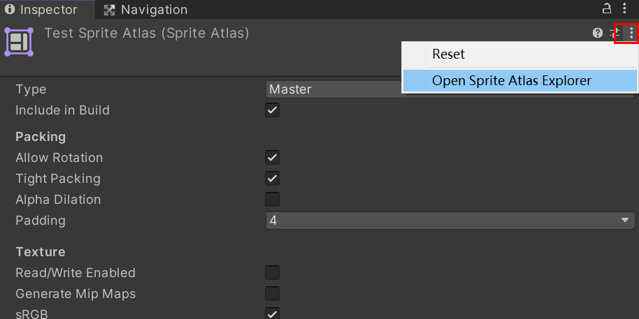

# Sprite Atlas Explorer

Utility for find source sprites from Sprite Atlas by clicking on the atlas textures.
It's useful when you want to optimize the size and memory usage of atlas textures. you wnat to find the origin sprite asset from Sprite Atlas after previewing the textures. When there are too many sprites in it, frequently looking for where the sprite comes from always takes too many times.
This tool can help you find the sprite from sprite atlas easily. By looking at the atlas texture, and clicking the sprite on it, it will navigate to the sprite asset.

## How to use
### supported Unity version
Support Unity 2019.4 or newer
### open
To open this tool, either by menu command Window->UI-Sprite Atlas Explorer, or Sprite Atlas's context menu "Open Sprite Atlas Explorer"

### usage
- Mouse scroll to zoom in/out the texture
- Hold mouse right button to drag texture
- Click with mouse left button to highlight the origin sprite asset

## Known issues
- not fully tested with SpriteAtlasv2
- to use the tool, Sprite Packer Mode needs to be set 'Sprite Atlas V1 - Always Enabled' in Editor section of Project Settings
- if you meet the error 'sprite(s) not connected to sprite atlas.', you need to enter and exit Play Mode quickly for one time. Before entering Play Mode, Unity will setup sprite data with sprite atlas, which is needed by this tool.

